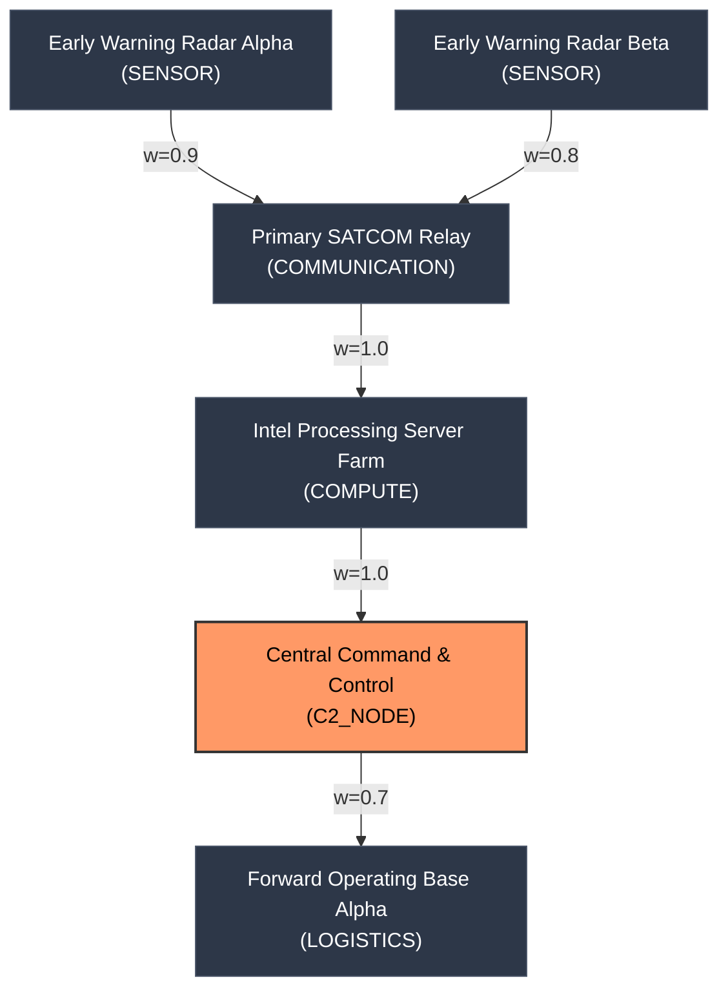

```mermaid
graph TD
    classDef spof fill:#f96,stroke:#333,stroke-width:2px,color:#000;
    classDef normal fill:#2d3748,stroke:#4a5568,stroke-width:1px,color:#fff;
    HQ_C2["Central Command & Control<br/>(C2_NODE)"]
    class HQ_C2 spof;
    SAT_LINK_01["Primary SATCOM Relay<br/>(COMMUNICATION)"]
    class SAT_LINK_01 normal;
    RADAR_ARRAY_A["Early Warning Radar Alpha<br/>(SENSOR)"]
    class RADAR_ARRAY_A normal;
    RADAR_ARRAY_B["Early Warning Radar Beta<br/>(SENSOR)"]
    class RADAR_ARRAY_B normal;
    ANALYTICS_HUB["Intel Processing Server Farm<br/>(COMPUTE)"]
    class ANALYTICS_HUB normal;
    FORWARD_BASE_01["Forward Operating Base Alpha<br/>(LOGISTICS)"]
    class FORWARD_BASE_01 normal;
    HQ_C2 -->|w=0.7| FORWARD_BASE_01
    SAT_LINK_01 -->|w=1.0| ANALYTICS_HUB
    RADAR_ARRAY_A -->|w=0.9| SAT_LINK_01
    RADAR_ARRAY_B -->|w=0.8| SAT_LINK_01
    ANALYTICS_HUB -->|w=1.0| HQ_C2
```